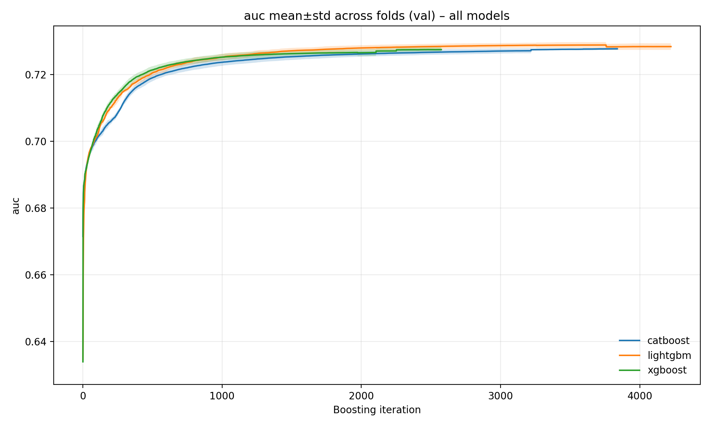
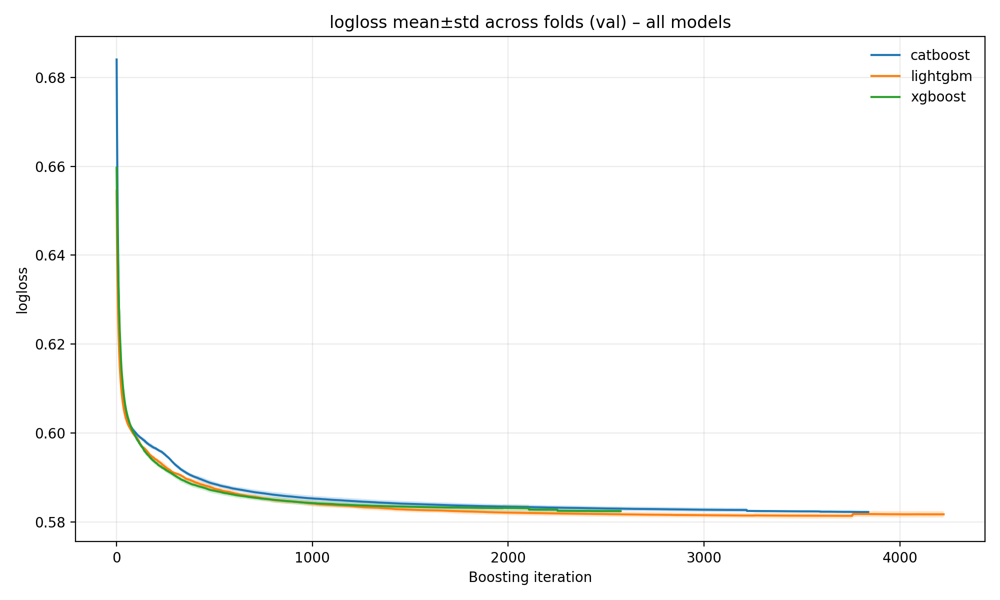
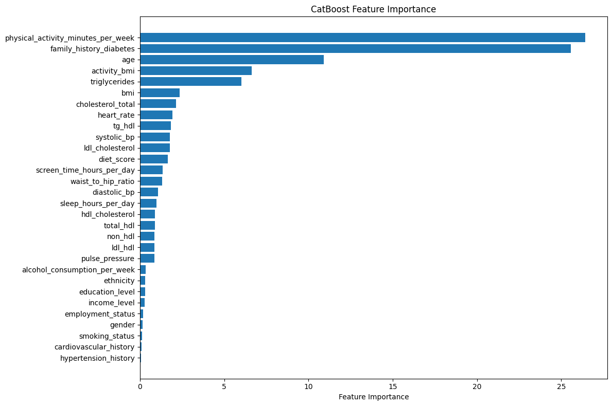
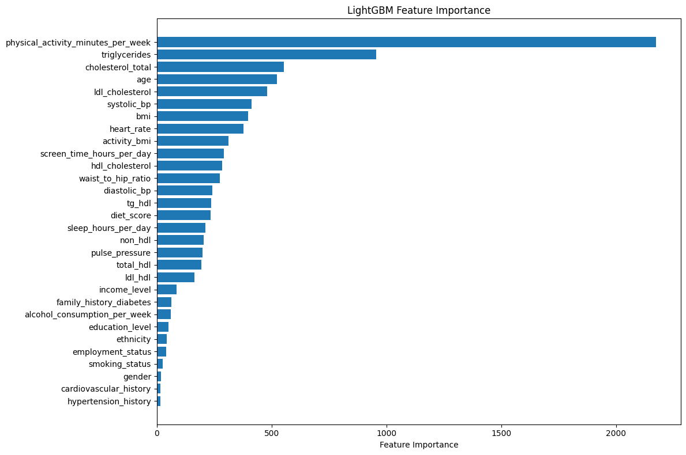
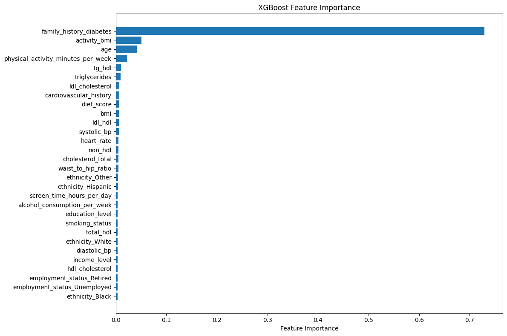

# Diabetes Prediction Binary Classification Report

## Problem and Metric
This project predicts whether a patient is diagnosed with diabetes based on tabular clinical and demographic features. It is a binary classification task evaluated with ROC-AUC, which is appropriate under class imbalance and avoids committing to a fixed decision threshold. The competition is hosted on Kaggle: https://www.kaggle.com/competitions/playground-series-s5e12/overview/abstract

## Data Summary
The training set contains 700,000 rows and 26 columns (including `id` and the target), while the test set has 300,000 rows and 25 columns. Features consist of numerical and categorical variables without missing values. These properties favor tree-based models that efficiently handle heterogeneous feature types and large sample sizes.

## Feature Engineering
A small set of ratio and interaction features was added based on routinely available measurements:
- Pulse pressure: systolic blood pressure − diastolic blood pressure
- Non-HDL cholesterol: total cholesterol − HDL cholesterol
- LDL/HDL ratio: LDL cholesterol / HDL cholesterol
- Triglycerides/HDL ratio: triglycerides / HDL cholesterol
- Total cholesterol/HDL ratio: total cholesterol / HDL cholesterol
- Physical activity per BMI: physical activity minutes per week / BMI

While tree-based models can learn non-linear relationships implicitly, including these carefully chosen features directly improves model stability and data efficiency.

## Model Selection Rationale
XGBoost served as the baseline model but required categorical features to be encoded as either ordinal or one-hot, which imposes assumptions that may not hold (e.g., treating education level as ordinal). All three models considered—XGBoost, LightGBM, and CatBoost—are gradient-boosted decision tree (GBDT) methods optimized via second-order (gradient and Hessian) objectives. LightGBM and CatBoost were selected in addition to XGBoost because they natively handle categorical features, with LightGBM prioritizing computational efficiency through gradient-based categorical splits and CatBoost prioritizing statistical robustness via ordered target statistics and ordered boosting.

## Cross-Validation Strategy
Stratified 5-fold cross-validation was used to preserve class proportions across folds and provide reliable generalization estimates. Since subsequent ensembling relied on out-of-fold predictions, it was important to ensure sufficiently large and representative training folds.

## Hyperparameter Tuning
Optuna was employed with Tree-structured Parzen Estimator (TPE) sampling to efficiently explore a constrained hyperparameter search space after feature engineering stabilized. Early stopping was applied to prevent overfitting, manage runtime and handle GPU timeouts.

## Ensemble Method
Out-of-fold (OOF) predictions were generated for each of the three models: XGBoost, CatBoost, and LightGBM. These OOF predictions enabled unbiased evaluation and blending. The final ensemble is a linear blend of the three models' probability outputs. Blend weights were selected via a direct three-weight (2 degrees of freedom) search optimizing OOF ROC-AUC. This approach leverages error diversity among models and reduces overfitting risk compared to tuning on in-fold predictions. Although the three models optimize similar objectives, they differ in tree growth strategies, categorical handling, and regularization behavior, resulting in partially uncorrelated errors. This diversity motivates ensembling and explains the consistent performance gain over any individual model.

## Figures and Diagnostics

The following figures summarize model training dynamics and motivate the ensemble strategy:

**Figure 1. Validation ROC-AUC (mean ± 1 std across folds).**  
This figure shows the mean validation ROC-AUC across boosting iterations for XGBoost, CatBoost, and LightGBM, with shaded regions indicating one standard deviation across cross-validation folds. Clearly, all three models rank really close to each other.

**Figure 2. Validation Logloss (mean ± 1 std across folds).**  
This figure shows the mean validation logloss across boosting iterations for the same three models, with shaded regions indicating one standard deviation across cross-validation folds. Again, all three models rank really close to each other, although LightGBM and CatBoost were trained for longer and had more iterations.

**Figure 3. Feature importance by model.**  
Feature importance plots for CatBoost, LightGBM, and XGBoost illustrate that each model emphasizes different predictors, indicating complementary decision patterns. Since each model pays attention to different features, the ensemble is more robust to feature selection and can better capture the underlying relationships.

**Figure 4. Ensemble prediction distribution.**  
The distribution of predicted probabilities from the ensemble compared with individual models highlights subtle but meaningful differences in calibration and confidence.

## Learnings
What worked:
- A small, motivated set of ratio features added meaningful signal without inflating the feature space.
- Stratified cross-validation with OOF predictions enabled reliable model comparison and ensembling.
- Native categorical handling simplified preprocessing and improved validation stability.
- Ensembling multiple models improved predictive performance over any single model.

What did not:
- Aggressive feature expansion via one-hot encoding was inefficient at this scale and added complexity without clear gains.

## Concepts and Tools Used
- Data handling and EDA: pandas and numpy workflows for sanity checks, class balance, and distribution and correlation inspection.
- Validation and metrics: Stratified K-fold CV, ROC-AUC evaluation, out-of-fold predictions.
- Feature processing: ordinal encoding, one-hot encoding, native categorical handling.
- Models: XGBoost, CatBoost, LightGBM classifiers.
- Optimization and regularization: early stopping, constrained hyperparameter search, Optuna-based tuning using TPE sampling.
- Ensembling: linear blending of model probabilities with weight selection using OOF ROC-AUC.

## References
- Chen and Guestrin, "XGBoost: A Scalable Tree Boosting System."
- Prokhorenkova et al., "CatBoost: unbiased boosting with categorical features."
- Ke et al., "LightGBM: A Highly Efficient Gradient Boosting Decision Tree."
- Anghel et al., "Benchmarking and Optimization of Gradient Boosting Decision Tree Algorithms."

## Footnote: Leaderboard Context

At the end of the competition, the final submission achieved **ROC-AUC of 0.69496**.

For reference, the top-ranked submission (ROC-AUC **0.70504**) reported using an extensive hill-climbing ensemble involving **40+ models**. This comparison highlights the diminishing returns of increasingly complex ensembles: the gap between a small, well-validated blend of a few strong models and a large-scale ensemble is relatively modest with low returns, while the latter requires substantially more engineering effort and computational resources, which also is required to squeeze out the best performance.